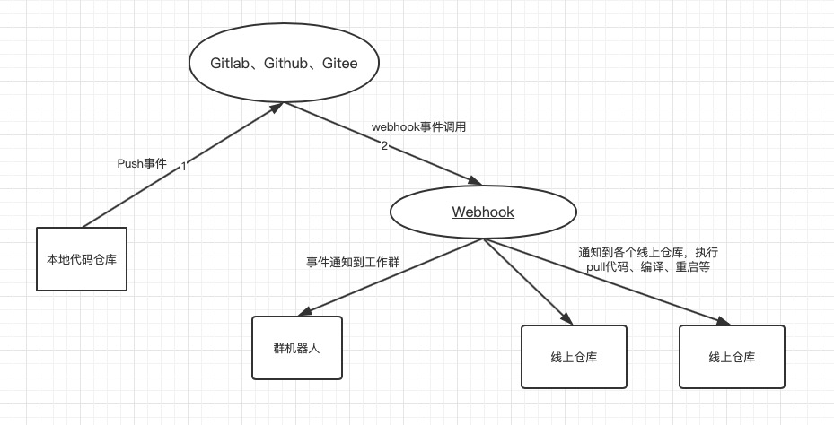

# webhook

1. git事件通知到群机器人。
2. 项目代码自动拉取编译重启（生产期自动部署，正式上线后建议不要使用）。

## 结构图



## 功能支持
git 支持：
- gitlab

机器人支持：
- 企业微信群机器人

事件支持：
- push
- merge_request


## 功能设计

**事件通知**

当我们push 代码到线上仓库，线上仓库必然知道这个push操作，就会hook（回调）这里的url。

将事件推送到队列，消费事件，机器人通知到群，通知到脚本节点（只推送push事件）。
```
func doEvent(e *Event) {

	r := robot.GetRobot(e.Homepage)
	if r != nil {
		r.Notify(e.Cmd, e.Args...)
	} 

	if tcpStarted && e.Cmd == common.PushEvent {
		clients, ok := homeNodes[e.Homepage]
		if ok {
            notify := &protocol.Notify{
			    Cmd:      proto.String(e.Cmd),
			    Homepage: proto.String(e.Homepage),
			    Branch:   proto.String(e.Branch),
		    }

			for _, c := range clients {
				err := c.Send(notify)
				if err != nil {
					doEvent(&Event{
						Homepage: e.Homepage,
						Cmd:      common.Message,
						Args:     []string{c.Name, err.Error()},
					})
				}
			}
		}
	}
}
```

**2.自动化部署** 

假设，我们有三个环境：

- 线上仓库。如Github、GitLab或Gitee（开源中国）
- 本地仓库。日常开发用的。
- 服务器仓库。

这里我们要达到的目的是，当有新的本地 commit push 到线上仓库时，服务器仓库自动pull最新线上仓库新的代码。

这里采用代理模式。可能部署了多台服务器。
仓库的事件推送到这里，再由这里通知到各个服务器，服务器上部署的client程序执行本地脚本。

## 配置

[webhook配置](doc/webhook配置.md)

[机器人配置](doc/机器人配置.md)

- configs/proxy
- configs/node


