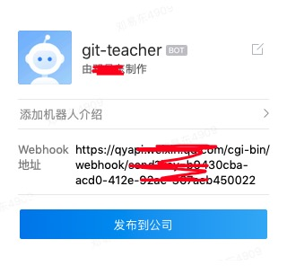

# 机器人配置

## 配置文件

```
[[Robot]]
RobotType   = "workweixin"
Homepage    = "https://tech.feiyi.com/deng/documts"
RobotUrl    = "https://qyapi.weixbin/webhook/sen"
NotifyCmd   = ["message","push","merge_request"]  # 通知到机器人的事件
```

## 企业微信机器人

1. 选择一个微信群，右键添加机器人。
2. 复制机器人的webhook地址到配置文件。



